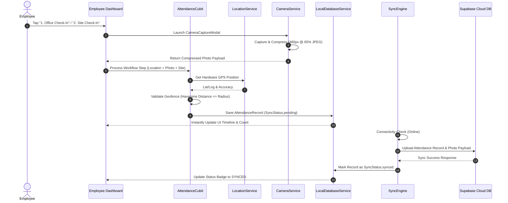

# 00. System Architecture & Engineering Blueprint

## Executive Overview
The **Fusion Attendance & Field Workforce Tracking Application** is a production-grade, offline-first mobile and web application designed for enterprise workforce management, location verification, employee timesheet auditing, and real-time field tracking. The application operates seamlessly in remote environments with zero network connectivity while maintaining real-time synchronization with cloud infrastructure whenever connectivity is restored.

---

## 1. High-Level Technology Stack

| Layer | Technology / Package | Purpose |
| :--- | :--- | :--- |
| **Framework** | Flutter (Dart 3.x) | Cross-platform mobile & web application engine |
| **State Management** | `flutter_bloc` / Cubit | Decoupled presentation & business logic management |
| **Local Storage** | `hive` & `hive_flutter` | High-performance offline key-value & document database |
| **Authentication** | Firebase Authentication (`firebase_auth`) | Identity management, password verification, & security tokens |
| **Cloud Database** | Supabase PostgreSQL (`supabase_flutter`) | Central relational database, real-time sync, RLS policies, & administrative persistence |
| **Hardware APIs**| `camera`, `geolocator`, `connectivity_plus`, `device_info_plus` | GPS location validation, live selfie capture, network monitoring, & hardware device fingerprinting |
| **Map Rendering** | OpenStreetMap / Flutter Map (`flutter_map`) & Leaflet.js | Interactive live tracking map with geofence radius visualizations (Flutter & Web Admin) |
| **Image Compression** | `image` (Dart native) | Downscales live camera frames to 480px @ 65% JPEG (99% payload reduction) |
| **Timesheet Calculator**| Internal (`TimesheetCalculator`) | Aggregates workflow steps into daily work durations, regular hours (capped at 8.0h), and overtime hours |
| **Exporting** | `csv`, `excel`, `pdf`, `printing` | Multi-format reporting and timesheet PDF rendering engine |
| **Standalone Web Admin**| HTML5, CSS3, JavaScript (ES6+), Supabase JS SDK, Leaflet.js | Lightweight, high-performance web portal for administrative management (`web_admin/`) |

---

## 2. Architectural Layers (Clean Architecture)

```
                       ┌───────────────────────────────────────────┐
                       │          Presentation Layer               │
                       │   (Screens, Widgets, Cubit States)        │
                       └─────────────────────┬─────────────────────┘
                                             │
                                             ▼
                       ┌───────────────────────────────────────────┐
                       │            Domain Layer                   │
                       │   (Entities, Value Objects, Enums)        │
                       └─────────────────────┬─────────────────────┘
                                             │
                                             ▼
                       ┌───────────────────────────────────────────┐
                       │             Data Layer                    │
                       │ (LocalDatabaseService, SupabaseService,   │
                       │   SyncEngine, CameraService, DeviceBinding)│
                       └───────────────────────────────────────────┘
```

### Key Modules & Directories
- `lib/core/`: Application constants (`app_colors.dart`, `app_enums.dart`), reusable UI widgets (`app_button.dart`, `custom_text_field.dart`, `status_badge.dart`, `offline_banner.dart`), core utilities (`geofence_calculator.dart`, `timesheet_calculator.dart`), and services (`location_service.dart`, `camera_service.dart`, `supabase_service.dart`, `pdf_export_service.dart`).
- `lib/database/`: Hive local database engine (`local_database_service.dart`) managing offline boxes: `organization`, `currentUser`, `employees`, `offices`, `attendanceRecords`, `pendingSyncRecords`, and `usersBox`.
- `lib/features/`: Feature-sliced business logic:
  - `auth/`: Login, dual-layer authentication cubit, initial password change, and session handling.
  - `setup/`: Organization onboarding, initial geofence configuration, Super Admin provisioning.
  - `admin/`: User management (3-tier RBAC), office station setup, work site management, ownership transfer, live GPS tracking map, executive dashboard.
  - `employee/`: Employee daily workflow dashboard, timeline, selfie capture.
  - `attendance/`: 4-step workflow Cubit, camera modal, site selection dialog, Haversine geofence validation.
  - `timesheet/`: Employee timesheet portal, daily work hour calculation, regular/overtime breakdown, PDF export.
  - `security/`: Hardware device binding service (`device_binding_service.dart`).
  - `sync/`: Background sync engine with exponential backoff & connectivity listener.
- `web_admin/`: Standalone Enterprise Web Admin Portal container (`index.html`, `styles.css`, `app.js`).

---

## 3. Data Flow Architecture



---

## 4. Relational Database Schema & Cloud Infrastructure

The Supabase PostgreSQL database schema ([backend/supabase_schema.sql](file:///c:/Users/srirs/.gemini/antigravity-ide/scratch/attendance_app/backend/supabase_schema.sql)) consists of **13 relational tables**:

1. `organizations`: Root enterprise entity profile.
2. `roles`: Standard system roles (`SUPER_ADMIN`, `ADMIN`, `EMPLOYEE`).
3. `users`: Authentication profiles, role assignments, active flags.
4. `user_role_assignments`: Junction table for multi-role support.
5. `offices`: Primary office stations and geofence radii.
6. `employees`: Extended employee details, employee codes, department, assigned offices.
7. `work_sites`: Client project locations, client names, site geofence radii.
8. `work_site_assignments`: Employee to work site mapping.
9. `attendance_records`: Attendance logs, workflow steps, GPS, photo URLs, site names.
10. `gps_logs`: Background movement tracking points.
11. `devices`: Bound hardware devices, hardware IDs, OS versions.
12. `notifications`: In-app system alerts.
13. `activity_logs`: Audit trail (`ORG_SETUP`, `EMPLOYEE_CREATED`, `OWNERSHIP_TRANSFERRED`, `DEVICE_BOUND`, etc.).

### Stored Procedures & Security
- **`transfer_organization_ownership(p_org_id, p_current_super_admin_id, p_target_admin_id)`**: Stored procedure performing atomic promotion of target Admin to Super Admin and demotion of current Super Admin to Admin within a single transaction.
- **Row-Level Security (RLS)**: Enforced across all tables isolating tenant data by `organization_id`.
