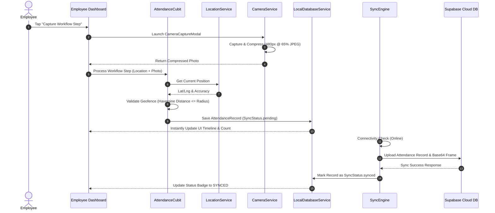

# 00. System Architecture & Engineering Blueprint

## Executive Overview
The **Fusion Attendance & Field Workforce Tracking Application** is a production-grade, offline-first mobile application designed for enterprise workforce management, location verification, and attendance auditing. The application operates seamlessly in remote environments with zero network connectivity while maintaining real-time synchronization with cloud infrastructure whenever connectivity is restored.

---

## 1. High-Level Technology Stack

| Layer | Technology / Package | Purpose |
| :--- | :--- | :--- |
| **Framework** | Flutter (Dart 3.x) | Cross-platform mobile application engine |
| **State Management** | `flutter_bloc` / Cubit | Decoupled presentation & business logic management |
| **Local Storage** | `hive` & `hive_flutter` | High-performance offline key-value & document database |
| **Authentication** | Firebase Authentication (`firebase_auth`) | Identity management, password verification, & security tokens |
| **Cloud Database** | Supabase PostgreSQL (`supabase_flutter`) | Central relational database, real-time sync & administrative persistence |
| **Hardware Hardware APIs**| `camera`, `geolocator`, `connectivity_plus` | GPS location validation, live selfie capture, & network monitoring |
| **Map Rendering** | OpenStreetMap / Flutter Map (`flutter_map`) | Interactive live tracking map with geofence radius visualizations |
| **Image Compression** | `image` (Dart native) | Downscales live camera frames to 480px @ 65% JPEG (99% payload reduction) |
| **Exporting** | `csv`, `excel`, `pdf`, `printing` | Multi-format reporting engine |

---

## 2. Architectural Layers (Clean Architecture)

```
                       ┌───────────────────────────────────────────┐
                       │          Presentation Layer               │
                       │   (Screens, Widgets, Cubit States)        │
                       └─────────────────────┬─────────────────────┘
                                             │
                                             ▼
                       ┌───────────────────────────────────────────┐
                       │            Domain Layer                   │
                       │   (Entities, Value Objects, Enums)        │
                       └─────────────────────┬─────────────────────┘
                                             │
                                             ▼
                       ┌───────────────────────────────────────────┐
                       │             Data Layer                    │
                       │ (LocalDatabaseService, SupabaseService,   │
                       │         SyncEngine, CameraService)        │
                       └───────────────────────────────────────────┘
```

### Key Modules & Directories
- `lib/core/`: Application constants (`app_colors.dart`, `app_enums.dart`), reusable UI widgets (`app_button.dart`, `status_badge.dart`, `offline_banner.dart`), and core services (`location_service.dart`, `camera_service.dart`, `supabase_service.dart`).
- `lib/database/`: Hive local database engine (`local_database_service.dart`) managing offline boxes: `organization`, `currentUser`, `employees`, `offices`, `attendanceRecords`, and `pendingSyncRecords`.
- `lib/features/`: Feature-sliced business logic:
  - `auth/`: Login, authentication cubit, initial password change.
  - `setup/`: Organization onboarding, initial geofence configuration.
  - `admin/`: User management, office station setup, live GPS tracking map, executive dashboard.
  - `employee/`: Employee daily workflow dashboard, timeline, selfie capture.
  - `attendance/`: 4-step workflowCubits, camera modals, geofence distance algorithms.
  - `reports/`: Attendance filtering, analytics, CSV/Excel/PDF export engine.
  - `sync/`: Background sync engine with exponential backoff & connectivity listener.

---

## 3. Data Flow Architecture



---

## 4. Environment & Configuration Security
- **Firebase Core Configuration**: Configured via `google-services.json` (Android) and `GoogleService-Info.plist` (iOS).
- **Supabase Credentials**: Embedded securely in `AppConfig` (`supabaseUrl` and `supabasePublishableKey`).
- **Resource Attribution**: All cloud operations strictly validate org tenancy via `organizationId`.
