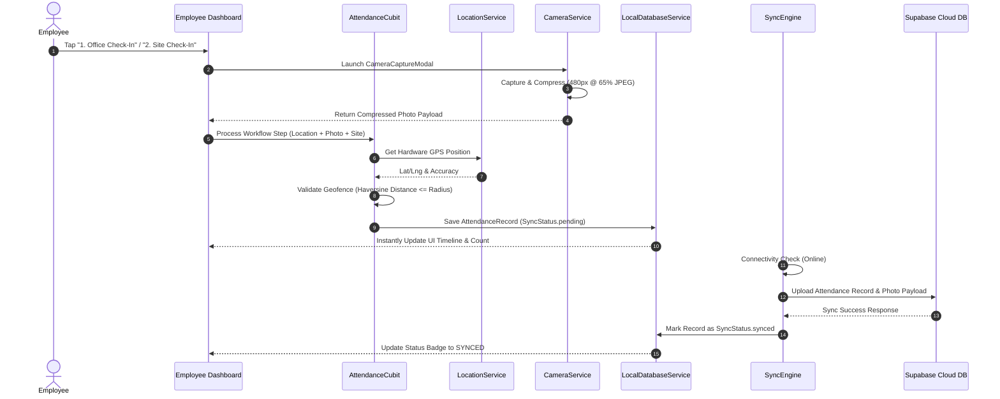

# 00. System Architecture & Engineering Blueprint

## Executive Overview
The **Fusion Attendance & Field Workforce Tracking Application** is a production-grade, offline-first mobile and web application designed for enterprise workforce management, location verification, employee timesheet auditing, and real-time field tracking. The application operates seamlessly in remote environments with zero network connectivity while maintaining real-time synchronization with cloud infrastructure whenever connectivity is restored.

---

## 1. High-Level Technology Stack

| Layer | Technology / Package | Purpose |
| :--- | :--- | :--- |
| **Framework** | Flutter (Dart 3.x) | Cross-platform mobile & web application engine |
| **State Management** | `flutter_bloc` / Cubit | Decoupled presentation & business logic management |
| **Local Storage** | `hive` & `hive_flutter` | High-performance offline key-value & document database |
| **Authentication** | Firebase Authentication (`firebase_auth`) | Identity management, password verification, & security tokens |
| **Cloud Database** | Supabase PostgreSQL (`supabase_flutter`) | Central relational database, real-time sync, RLS policies, & administrative persistence |
| **Document AI & OCR** | Google Gemini Multimodal Vision API (`CardOcrService`) | Automated document scanning & metadata extraction for employee statutory cards & passes |
| **Automated Compliance Robot** | Supabase `pg_cron` & `pg_net` | Daily 08:00 AM GST background compliance checks & multi-channel notification dispatch |
| **Notification Services** | Resend Email API & CallMeBot WhatsApp API | Automated & manual direct compliance alerts to operations executives |
| **Hardware APIs**| `camera`, `geolocator`, `connectivity_plus`, `device_info_plus` | GPS location validation, live selfie capture, network monitoring, & hardware device fingerprinting |
| **Map Rendering** | OpenStreetMap / Flutter Map (`flutter_map`) & Leaflet.js | Interactive live tracking map with geofence radius visualizations (Flutter & Web Admin) |
| **Image Compression** | `image` (Dart native) | Downscales live camera frames to 480px @ 65% JPEG (99% payload reduction) |
| **Timesheet, Salary & Payroll Engine**| Internal (`TimesheetCalculator`, `SalaryCalculator`, `SalaryCycleHelper`, `LeaveCalculator`, `WpsMasterRegistry`) | Aggregates daily duty durations (with 1h food break & 1h travel tolerance rules), calendar-month & Oct transition Interim OT salary cycles, Sunday 100% OT & Paid Sunday Off rules, 24h auto check-out capping, 5-state daily leave ledger, and UAE WPS division payroll |
| **Exporting** | `csv`, `excel`, `pdf`, `printing` | Multi-format reporting, timesheet & payslip PDF rendering, division WPS Excel workbooks, Master Payroll Excel, and Interim OT exports |
| **Theming & UI Shell** | `ThemeCubit`, `AppThemePalettes`, `AppShell` | 5 curated theme presets (`Slate Indigo`, `Emerald Mint`, `Midnight Amber`, `Royal Amethyst`, `Ocean Cobalt`) with Light/Dark contrast |
| **Standalone Web Admin**| HTML5, CSS3, JavaScript (ES6+), Supabase JS SDK, Leaflet.js | Lightweight, high-performance web portal for administrative management (`web_admin/`) |


---

## 2. Architectural Layers (Clean Architecture)

```
                       ┌───────────────────────────────────────────┐
                       │          Presentation Layer               │
                       │   (Screens, Widgets, Cubit States)        │
                       └─────────────────────┬─────────────────────┘
                                             │
                                             ▼
                       ┌───────────────────────────────────────────┐
                       │            Domain Layer                   │
                       │   (Entities, Value Objects, Enums)        │
                       └─────────────────────┬─────────────────────┘
                                             │
                                             ▼
                       ┌───────────────────────────────────────────┐
                       │             Data Layer                    │
                       │ (LocalDatabaseService, SupabaseService,   │
                       │   SyncEngine, CameraService, DeviceBinding)│
                       └───────────────────────────────────────────┘
```

### Key Modules & Directories
- `lib/core/`: Application constants (`app_colors.dart`, `app_enums.dart`, `employee_photo_data.dart`, `wps_registry.dart`), theming (`app_theme_preset.dart`, `theme_cubit.dart`, `theme_selector_modal.dart`), reusable UI widgets (`app_button.dart`, `custom_text_field.dart`, `status_badge.dart`, `offline_banner.dart`, `employee_avatar.dart`, `app_shell.dart`), core utilities (`geofence_calculator.dart`, `timesheet_calculator.dart`, `salary_cycle_helper.dart`, `leave_calculator.dart`, `employee_directory_helper.dart`), and services (`location_service.dart`, `camera_service.dart`, `supabase_service.dart`, `card_ocr_service.dart`, `card_expiry_notification_service.dart`, `pdf_export_service.dart`, `excel_csv_export_service.dart`).
- `lib/database/`: Hive local database engine (`local_database_service.dart`) using the `app_settings` box (JSON-persisted collections for organization, current user, users, employees, offices, work sites, attendance records, salaries, cards, API tokens, and `geofence_bypass_overrides`).
- `lib/features/`: Feature-sliced business logic:
  - `auth/`: Login, dual-layer authentication cubit, initial password change, and session handling.
  - `setup/`: Organization onboarding, initial geofence configuration, Super Admin provisioning.
  - `admin/`: User management (3-tier RBAC & per-employee geofence bypass toggle), office station setup, work site management, ownership transfer, live GPS tracking map, reports & analytics, attendance editing, and **Cards Manager (`CardsManagementScreen`)**.
  - `salary/`: Division-aware **Salary & Payroll Module (`SalaryPayrollScreen`)**, `SalaryCalculator`, `PutOfficeAttendanceDialog` calendar attendance, `InterimOtBreakdownDialog`, `EditSalaryDialog`, and `EmployeeSalaryDetailSheet`.
  - `employee/`: Employee daily workflow dashboard, timeline, selfie capture, and profile avatar.
  - `attendance/`: 4-step workflow Cubit, camera modal, `BreakTypeDialog`, `SiteNameDialog`, Haversine geofence validation & bypass check.
  - `timesheet/`: Employee timesheet portal, daily work hour calculation, calendar-month & Oct transition salary cycle metrics, break/travel tolerance, regular/overtime breakdown, Sunday 100% OT rules, and PDF export.
  - `security/`: Hardware device binding service (`device_binding_service.dart`).
  - `sync/`: Background sync engine with 15-minute periodic flush & connectivity listener.
- `web_admin/`: Standalone Enterprise Web Admin Portal container (`index.html`, `styles.css`, `app.js`) with feature parity including Cards Compliance Manager, Gemini OCR scanner, per-employee geofence toggle, calendar-month salary cycles, WhatsApp/Email alert triggers, and real-time Leaflet map.
- `backend/`: PostgreSQL database schemas (`supabase_schema.sql`, `create_employee_salaries_table.sql`), migrations (`add_bypass_geofence_columns.sql`, `add_custom_monthly_ot_amount_column.sql`), and automated background compliance robot (`supabase_cron_job.sql`).


---

## 3. Data Flow Architecture


```mermaid
sequenceDiagram
    autonumber
    actor Employee
    participant UI as Employee Dashboard
    participant Cubit as AttendanceCubit
    participant Location as LocationService
    participant Camera as CameraService
    participant Hive as LocalDatabaseService
    participant Sync as SyncEngine
    participant Supabase as Supabase Cloud DB

    Employee->>UI: Tap "1. Office Check-In" / "2. Site Check-In"
    UI->>Camera: Launch CameraCaptureModal
    Camera->>Camera: Capture & Compress (480px @ 65% JPEG)
    Camera-->>UI: Return Compressed Photo Payload
    UI->>Cubit: Process Workflow Step (Location + Photo + Site)
    Cubit->>Location: Get Hardware GPS Position
    Location-->>Cubit: Lat/Lng & Accuracy
    Cubit->>Cubit: Validate Geofence (Haversine Distance <= Radius)
    Cubit->>Hive: Save AttendanceRecord (SyncStatus.pending)
    Hive-->>UI: Instantly Update UI Timeline & Count
    Sync->>Sync: Connectivity Check (Online)
    Sync->>Supabase: Upload Attendance Record & Photo Payload
    Supabase-->>Sync: Sync Success Response
    Sync->>Hive: Mark Record as SyncStatus.synced
    Hive-->>UI: Update Status Badge to SYNCED
```

---

## 4. Relational Database Schema & Cloud Infrastructure

The Supabase PostgreSQL database schema ([backend/supabase_schema.sql](file:///c:/Users/srirs/.gemini/antigravity-ide/scratch/attendance_app/backend/supabase_schema.sql), [backend/create_employee_salaries_table.sql](file:///c:/Users/srirs/.gemini/antigravity-ide/scratch/attendance_app/backend/create_employee_salaries_table.sql), and [backend/supabase_cron_job.sql](file:///c:/Users/srirs/.gemini/antigravity-ide/scratch/attendance_app/backend/supabase_cron_job.sql)) consists of **16 relational tables**:

1. `organizations`: Root enterprise entity profile.
2. `roles`: Standard system roles (`SUPER_ADMIN`, `ADMIN`, `EMPLOYEE`).
3. `users`: Authentication profiles, role assignments, active flags, and `bypass_geofence` toggle.
4. `user_role_assignments`: Junction table for multi-role support.
5. `offices`: Primary office stations, geofence radii, and soft-deletion flags.
6. `employees`: Extended employee details, employee codes, department, assigned offices, and `bypass_geofence` toggle.
7. `work_sites`: Client project locations, client names, site geofence radii.
8. `work_site_assignments`: Employee to work site mapping.
9. `attendance_records`: Attendance logs, workflow steps, GPS, photo URLs, site names, manual OT overrides, edit audit fields (`is_edited`, `edited_by`), and auto check-out indicators.
10. `gps_logs`: Background movement tracking points.
11. `devices`: Bound hardware devices, hardware IDs, OS versions.
12. `notifications`: In-app system alerts.
13. `activity_logs`: Audit trail (`ORG_SETUP`, `EMPLOYEE_CREATED`, `OWNERSHIP_TRANSFERRED`, `DEVICE_BOUND`, geofence bypass changes, etc.).
14. `employee_cards`: Employee statutory cards and access passes (Emirates ID, Visa, Passport, Insurance, MOPA, CISPA, Custom), issue & expiry dates, file attachments, and notification tracking timestamps.
15. `compliance_notification_settings`: Automated compliance robot settings, API credentials (Resend & CallMeBot), notification recipient lists, active toggles, and execution logs.
16. `employee_salaries`: Master salary configurations per employee (`fixed_salary`, `variable_salary`, `daily_divisor`, `standard_daily_hours`, `custom_ot_hourly_rate`, `custom_monthly_ot_amount`, `ot_included_in_variable`, `pay_sunday_if_monday_worked`).

### Stored Procedures, Functions & Scheduled Tasks
- **`transfer_organization_ownership(p_org_id, p_current_super_admin_id, p_target_admin_id)`**: Stored procedure performing atomic promotion of target Admin to Super Admin and demotion of current Super Admin to Admin within a single transaction.
- **`process_daily_card_compliance_alerts()`**: Background function dispatched daily at 08:00 AM GST via `pg_cron` to evaluate expiring cards and trigger HTTP notifications via `pg_net`.
- **`url_encode(data text)`**: PL/pgSQL RFC 3986 URL encoder for WhatsApp CallMeBot query parameter construction.
- **Row-Level Security (RLS)**: Enforced across all tables isolating tenant data by `organization_id`.

